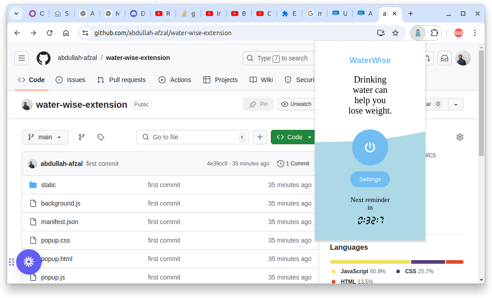
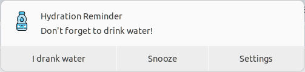

Here’s a sample `README.md` for your Chrome extension "Water Wise," which sends reminders to drink water:

---

# Water Wise - Hydration Reminder Chrome Extension

**Water Wise** is a simple and intuitive Chrome extension designed to help you stay hydrated throughout the day by sending timely reminders to drink water. Customize your daily water intake goals, set reminders at regular intervals, and ensure you're on top of your hydration with ease!

## Features

- ⏰ **Custom Reminders**: Set reminders to drink water at intervals that suit your schedule.
- 🥛 **Personalized Hydration Goals**: Customize your daily water intake goal and glass size.
- 🕰️ **Flexible Schedule**: Set your start and end time for reminders throughout your active hours.
- 🔕 **Snooze Feature**: Snooze reminders if you're not ready for a drink just yet.
- 📊 **Track Progress**: Stay on top of your hydration with reminders calculated to match your target intake.

## Installation

After I publish it on google web store you can Download the extension until than  
install it manually by following these steps:
1. Clone or download this repository:
   ```bash
   git clone https://github.com/abdullah-afzal/water-wise-extension.git
   ```
2. Go to `chrome://extensions/` in your Chrome browser.
3. Enable **Developer mode** by toggling the switch in the top-right corner.
4. Click on **Load unpacked** and select the folder where you cloned or downloaded the extension.
5. Water Wise is now installed!

## How to Use

1. After installing, click on the **Water Wise** icon in your Chrome toolbar to open the extension popup.
2. Use the power button to enable/disable hydration reminders.
3. Click the **Settings** button to customize:
   - Glass size (default: 250 ml)
   - Daily water goal (default: 2 liters)
   - Start time (default: 9:00 AM)
   - End time (default: 9:00 PM)
4. Reminders will be calculated to help you reach your water intake goal evenly throughout the day.
5. When a reminder pops up, you can either confirm you've had your drink or snooze the reminder for later.

## Screenshots


*Water Wise Popup UI*


*Water Wise Notification UI*

## Permissions

- **Notifications**: Used to send you reminders to drink water.
- **Alarms**: Used to schedule water reminders throughout the day.

## Contributing

Feel free to open issues or submit pull requests to improve Water Wise. If you have ideas for new features or enhancements, let’s collaborate!

## License

This project is licensed under the MIT License.

---

© 2024 [abdullah-afzal](https://github.com/abdullah-afzal)
---